# uart-lab

A browser-based console for configuring and monitoring UART sensors, with no
driver or application to install, built on the
[Web Serial API](https://developer.mozilla.org/docs/Web/API/Web_Serial_API).

First supported device: the **Hi-Link HLK-LD2420**, a 24 GHz mmWave human
presence radar.

> **Live demo** — <https://thecampagnards.github.io/uart-lab/>
> It ships with a simulated LD2420, so the whole interface can be explored
> without hardware.

## What it does

- **Connects** to the module through any USB-UART bridge (FT232RL, CP2102,
  CH340…), at any rate from 9600 to 460800 baud.
- **Live monitoring**: presence, distance, per-gate energy for all 16 gates, a
  distance timeline and a time × gate heatmap.
- **Presence setup**: records the area empty, then occupied, and works out
  thresholds that sit between the two — and tells you which gates a person
  actually crossed.
- **Serial monitor**: the raw stream in text or hex, both directions, with
  nothing decoded — for working out whether a device is talking at all, and at
  what bit rate.
- **Configuration**: minimum and maximum gate, absence delay, and all 32
  thresholds (motion and still) — shown both raw and in dB.
- **Import/export** of the configuration as JSON — as a file, or read and pasted
  straight from the page — factory reset, module restart.
- **Firmware update**: write a `.bin` image to the module, with the image
  validated first and progress reported block by block.
- **Generic flashing**: a second device entry drives the same transfer against a
  descriptor you write — command bytes, block and flash sizes, status values —
  so a module this project has never seen can be reached without a code change.
- **Serial trace** in hex, to cross-check against the protocol documentation.
- **Built-in simulated module**, to try the tool out or develop without a sensor.

Everything runs on your machine: no data is sent anywhere, and there is no
server.

## Requirements

|          |                                                                                        |
| -------- | -------------------------------------------------------------------------------------- |
| Browser  | Chrome, Edge or Opera **on desktop** (Web Serial exists on neither Firefox nor Safari) |
| Context  | HTTPS, or `http://localhost`                                                           |
| Hardware | HLK-LD2420 + a USB-UART bridge set to **3.3 V**                                        |



`OT1` is the module's serial output — there is no pin called TX. The full notes,
including how to check the port from a shell, are in
[`doc/hardware-ft232rl.md`](doc/hardware-ft232rl.md).
**The module is a 3.3 V part: powering it from 5 V destroys it.**

## Getting started

```sh
npm install
npm run dev      # http://localhost:5173
```

Then use "Choose a serial port…" and pick your USB bridge — or "Simulated demo"
to explore without hardware.

### Scripts

| Command            | Purpose                                       |
| ------------------ | --------------------------------------------- |
| `npm run dev`      | development server                            |
| `npm run build`    | typecheck, then production build into `dist/` |
| `npm run preview`  | serve the production build                    |
| `npm test`         | test suite (Vitest)                           |
| `npm run coverage` | coverage for the protocol and core layers     |
| `npm run lint`     | ESLint                                        |
| `npm run format`   | Prettier                                      |

## Layout

```
src/
  core/         bytes, transport, Web Serial, measurement buffer
  devices/
    registry.ts device catalogue
    ld2420/     constants, frames, config, driver, simulator
  hooks/        session, live snapshots
  ui/           Mantine components and visx charts
doc/            protocol, wiring, architecture
```

Built with [Vite](https://vite.dev), [React](https://react.dev),
[Mantine](https://mantine.dev) for the components and
[visx](https://airbnb.io/visx) for the charts. Nothing below the UI depends on
either, which is what keeps the protocol layer testable in plain Node.

Devices declare what they can do, and the shell turns that into tabs: the
LD2420 offers monitoring, presence setup, configuration, firmware and the frame
trace; **Any serial device** — which has no driver at all — offers the raw
serial monitor and generic flashing. The details, and how to add a device,
are in [`doc/architecture.md`](doc/architecture.md).

## About the protocol

The LD2420's serial protocol is not published by the manufacturer. This project
builds on the reverse engineering done by **Damian Michna**, redistributed as
[`doc/hlk-ld2420-serial-protocol.md`](doc/hlk-ld2420-serial-protocol.md) under
CC BY-SA 4.0.

The points that document leaves open — the report frame layout, the multiplexing
of four encodings, batch limits — are written up in
[`doc/protocol-notes.md`](doc/protocol-notes.md).

### Firmware update

The Firmware tab writes a `.bin` image to the module. Read
[`doc/protocol-notes.md`](doc/protocol-notes.md) before using it: entering
upgrade mode stops the module answering anything else, and the protocol
documentation records no way back out except completing a transfer. The image is
checked locally first — length, 4-byte alignment, flash size — and the write is
behind an explicit acknowledgement and a confirmation, because an interrupted
transfer leaves the module waiting for another attempt rather than working.

## Licence

MIT — see [`LICENSE`](LICENSE).

Exception: `doc/hlk-ld2420-serial-protocol.md` is redistributed under
[CC BY-SA 4.0](https://creativecommons.org/licenses/by-sa/4.0/), © Damian Michna.

## Acknowledgements

- [Damian Michna](https://github.com/damianmichna/hi-link) — serial protocol
  documentation.
- ESPHome's [`ld2420` component](https://github.com/esphome/esphome/tree/dev/esphome/components/ld2420)
  — report frame layout and debug-mode constants.
